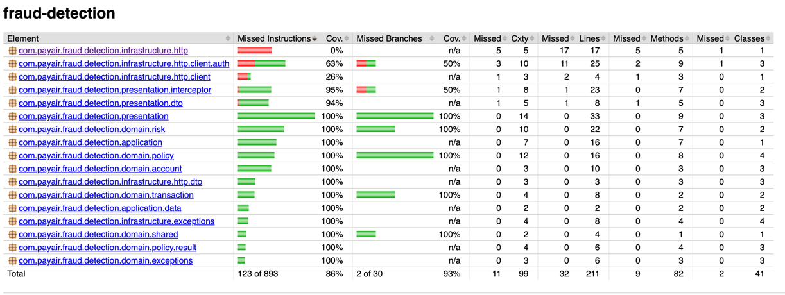

# Fraud Detection Service

Exercise project made using Java21 and Quarkus for recruitment task.

## Disclaimer

I'm aware that patterns that I've used are an overkill for given problem. I wanted to showcase approach I would normally use when implementing such feature in "real" project. I also used this as a learning sandbox to play around with Quarkus which I've never done before. 

## How to run

Application requires Mastercard API integration. 

1. Follow credentials generation [instructions](https://developer.mastercard.com/bin-lookup/documentation/quick-start-guide/)
2. Download and unzip generated keystore (You can copy the keystore to `etc/keystores`)
3. Provide environmental variables:
   * MASTERCARD_KEYSTORE_PATH
   * MASTERCARD_KEYSTORE_PASSWORD
   * MASTERCARD_KEY_ALIAS
   * MASTERCARD_CONSUMER_KEY
4. Run the application with `mastercard` profile enabled

## Authentication

Exposed endpoint requires JWT authentication. To generate ready to use token run test `com.payair.fraud.detection.jwt.JwtGeneratorTest.jwtGenerationVector`

## Testing

Project contains 3 types of tests:

1. Unit tests
2. Integration tests with WireMock
3. E2E tests with Mastercard integration (just an example with happy path)

"E2E" tests aren't run on build with the rest due to strong coupling with internet access and Mastercard API availability. To run e2e with all the other tests run: `./gradlew test -Pe2e=true`

## Coverage

I didn't aim for 100% coverage as I find it pointless in terms of this exercise. Many corner cases aren't covered, but I believe I've provided all the tools for further testing.

